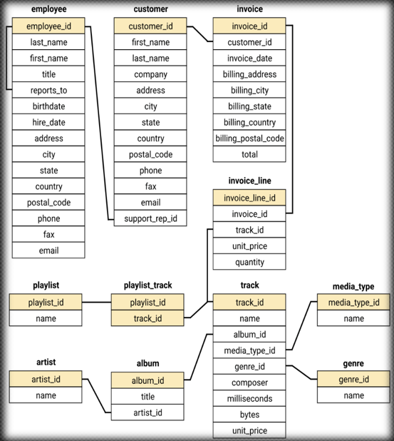

# 🎵 SQL Music Store Analysis

## 📊 Project Type
**Data Analytics**

## 🛠️ Tech Stack / Tools Used
- SQL Workbench
- MySQL
- DB schema: Chinook-style Music Store database

---

## 🎯 Objective
The company is planning to launch a new product and needs **data-driven insights** to make informed decisions.

---

## ❓ Problem Statements
1. 🧑‍💼 Assigning a project lead — Who is the **senior-most employee** based on job title?
2. 🌍 Identifying customer base — Which **country has the most invoices**?
3. 💰 Revenue focus — What are the **top 3 highest invoices**?
4. 🎉 Marketing opportunity — Which **city generated the most revenue**?
5. 🥇 Top spender — Who is the **best customer** based on total spending?
6. 🎸 Music preference — Which customers listen to **Rock music**?
7. 🤘 Artist collaboration — Which artists have **written the most Rock songs**?
8. 🌎 Genre trends — What is the **most popular genre by country**?
9. 🎁 Customer rewards — Which customer has **spent the most per country**?
10. 💵 Artist revenue — How much **each customer spent on each artist**?

---

## 📁 Data Source
A simulated music store database consisting of:
- `customer`, `invoice`, `invoice_line`
- `track`, `album`, `artist`, `genre`
- `employee`, `media_type`, and other metadata tables

---

## 🔍 Key Insights
🇺🇸 USA leads in customer activity, having the highest number of invoices, indicating it as the strongest market for the music store.

🌆 Prague and Paris generate the highest total invoice amounts, making them the top-performing cities in terms of revenue.

🧑‍💼 The senior-most employee has been identified, which is useful for understanding the company’s organizational structure.

💸 The top 3 customers contribute significantly to overall revenue, suggesting the value of customer segmentation and loyalty programs.

🎸 Rock is the most popular genre by purchase count, making it a key focus for future product offerings and promotions.

🎵 The top 10 tracks account for the majority of revenue, helping in identifying high-performing content.

🎨 Customers show distinct preferences for specific artists, and spending patterns per artist can inform personalized marketing.

📊 Sales distribution by genre and invoice totals by country provide useful visual insights for strategic regional planning.

💰 Artist revenue is unevenly distributed, pointing toward a small set of artists driving most of the sales..

---

## 🧑‍💻 How to Run This Project

1. Open **SQL Workbench**.
2. Connect to the database containing the `music` schema.
3. Paste and run each query from the SQL script.
4. Review output tables in the result grid.

> 💡 Make sure your database matches the structure of the Chinook dataset (tables like `customer`, `invoice`, `track`, `artist`, etc.)
---

## 📸 Database Schema

---

## 🖼️ Screenshots / Visuals

### 1. Senior Most Employee
![Senior Most Employee]screenshots)

### 2. Country with Most Invoices

### 3. Top 3 Customers by Invoice Value

### 4. Customer Spending per Artist

### 5. Most Popular Genre by Purchase Count

### 6. City with Highest Invoice Value

### 7. Top Revenue Tracks

### 8. Sales Distribution by Genre

### 9. Invoice Value by Country

### 10. Artist Revenue Summary

---

## 👨‍💻 Author
**Anurag Sharma**

---

## 📂 Files Included

| File Name           | Description                                |
|---------------------|--------------------------------------------|
| `README.md`         | Project documentation                      |
| `queries.sql`       | All SQL queries used for analysis          |
| `database schema.png` | Schema diagram of the database           |
| `screenshots/`      | Output screenshots of each query           |

---

## 📌 Notes
This project showcases how raw SQL can be used effectively for business decision support, without needing external tools like Python or Excel.

---
